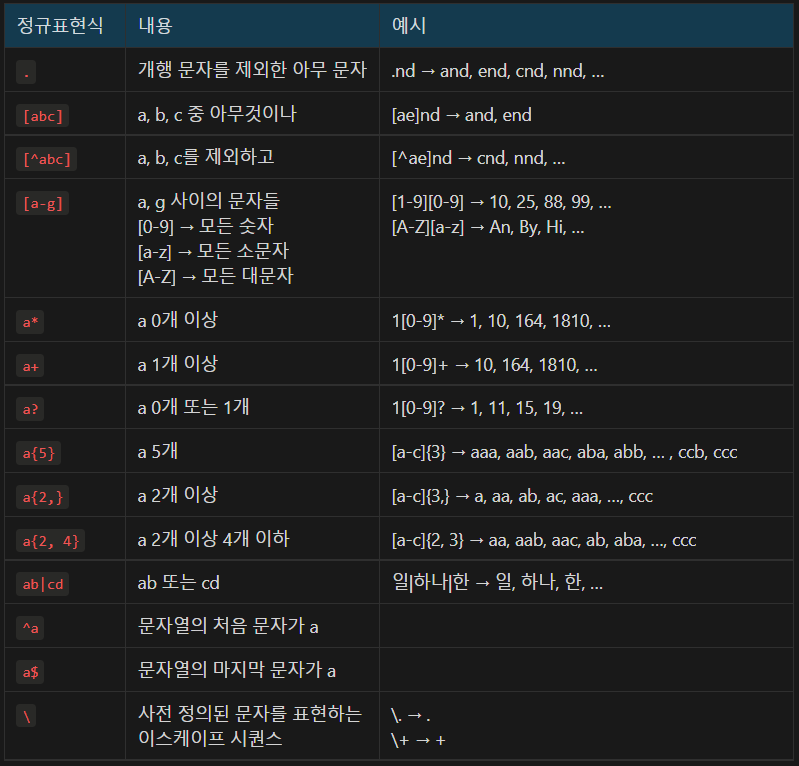

- 자주 사용되는 정규표현식



- String 클래스의 정규표현식 관련 메서드

| 메서드 | 반환형 | 내용 |
| --- | --- | --- |
| replaceAll(String regex, String replacement) | String | 전달받은 정규표현식에 매칭되는 패턴을 모두 replacement로 치환 |
| matches(String regex) | boolean | 문자열이 전달받은 정규표현식에 매칭되는지 여부를 반환 |
| split(String regex) | String[] | 전달받은 정규표현식에 매칭되는 패턴을 기준으로 원본 문자열을 잘라서 반환 |

예로 들어 문자열이 모두 소문자인지 검사하는 코드를 살펴봅시다. 소문자는 [a-z]를 사용하여 표현 가능하고, 이것이 몇 번 등장할지 모르므로 *로 정규표현식을 구성합니다.

```java
boolean matches = s.matches("[a-z]*");
```