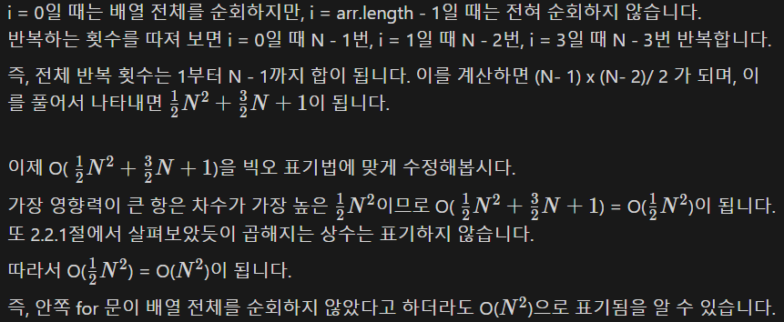

- 시간 복잡도 수식에 가장 큰 입력을 대입하여 계산한 결과가 보통 1억 미만이야 함.

- 코드 혹은 알고리즘의 실행 시간과 데이터의 상관관계
- 코드의 실행 시간이 어떤 요인으로 결정되는지 나타내는 시간과 입력 데이터의 함수 관계

- 빅오 표기법

⇒ 입력 크기가 N이고 이에 비례하는 시간이 걸린다면 O(N)으로 표기

- 알고리즘과 시간 복잡도

| 알고리즘 | 시간 복잡도    |
| --- |-----------|
| 이진 탐색 | O(logN)   |
| 선형 탐색 | O(N)      |
| 정렬 | O(N logN) |
| 조합 | O(2의 N승)  |
| 순열 | O(N!)     |
| 단순 연산 | O(1)      |

- 시간 복잡도별 N 크기에 따른 계산 결과(정수로 반올림)

|  | 10 | 20 | 100 | 10,000 | 1,000,000 | 100,000,000 |
| --- | --- | --- | --- | --- | --- | --- |
| O(1) | 1 | 1 | 1 | 1 | 1 | 1 |
| O(logN) | 3 | 4 | 7 | 13 | 20 | 27 |
| O(N) | 10 | 20 | 100 | 10,000 | 1,000,000 | 100,000,000 |
| O(N logN) | 33 | 86 | 664 | 132,877 |  |  |
| O($2^N$) | 1,024 | 1,048,576 | - | - |  |  |
| O(N!) | 3,628,800 | - | - | - |  |  |

- 제한 시간이 1초일 때 유추 가능한 시간 복잡도와 알고리즘

| N | 유추 가능한 시간 복잡도          | 유추 가능한 알고리즘 |
| --- |------------------------| --- |
| 10 | O(N!)                  | 순열 |
| 20 | O(2의 N승)               | 조합 |
| 1,000~ | O(N의 3승), O(N의 3승logN) | 완전 탐색, 이진 탐색 |
| 10,000~ | O(N logN)              | 정렬, 이진 탐색 |

- 다음 코드의 시간 복잡도를 알아보자.

```java
int[] arr = ...// 길이가 N인 배열
        
for (int i = 0; i < arr.length; i++) {
	for (int j = i + 1; j < arr.length; j++) {
		int a = arr[i];
		int b = arr[j];
    System.out.println(a + " + " + b + " = " + (a + b));
	}
}
```

이 코드에서 안쪽 for 문은 배열 전체를 돌지 않고 i 값에 따라 순회하는 범위가 정해집니다.



---

시간 복잡도는 코드를 작성하기 전 자신의 풀이가 충분히 효율적인지 판단할 수 있는 굉장히 중 요한 요소입니다.

시간 복잡도를 생각하지 않고 코드를 작성하다 시간 초과를 띄우게 되면 처음 부터 다른 풀이를 다시 생각해야 하므로 시간적 손해가 매우 큽니다.
또 시간 복잡도는 이후 면접 과정에서도 자주 언급되는 만큼 아주 중요한 지식이므로 풀이를 고 안한 후에는 항상 시간 복잡도를 따지고, 효율성이 검증되면 그때 코드를 작성하도록 합시다.